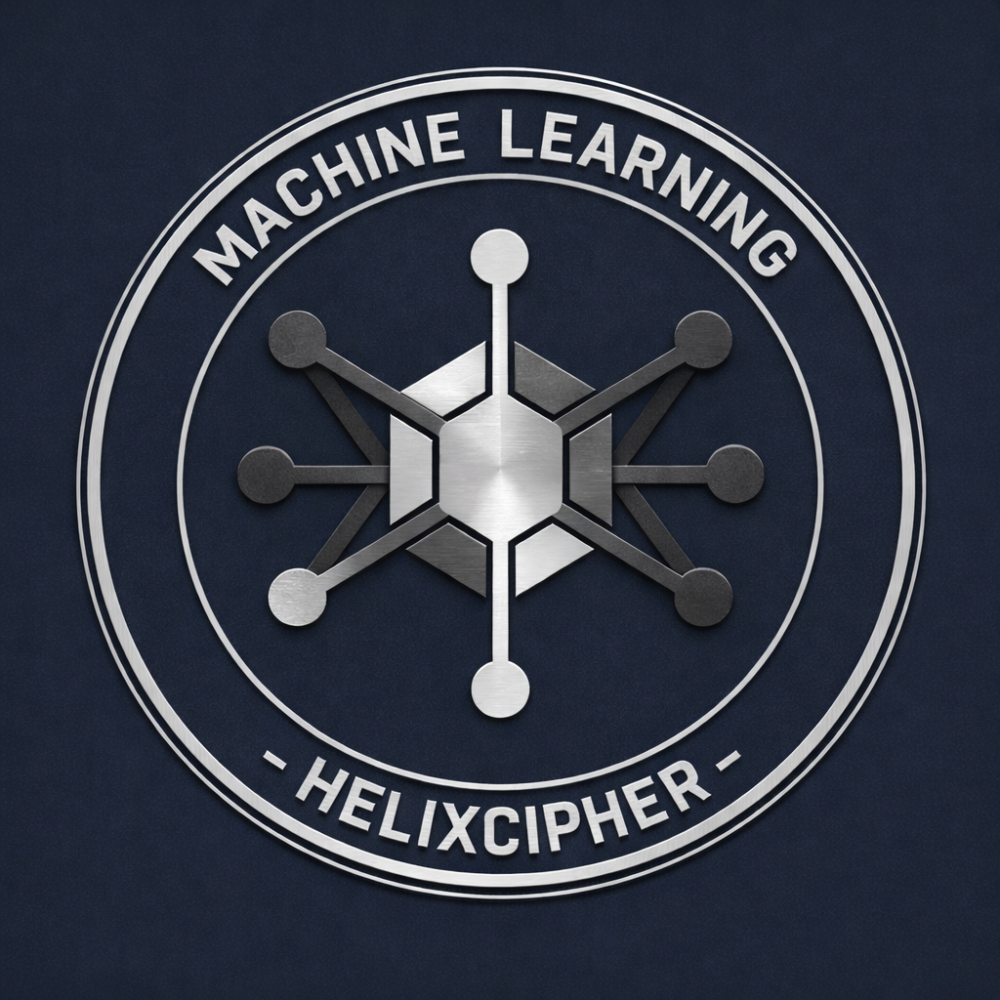

# Machine Learning Projects



A curated collection of machine learning projects covering various domains including computer vision, predictive modeling, and data analysis.

<br><br>
<br><br>
<br><br>
<br><br>

## Projects

| Project | Description |
|---------|-------------|
| [Digit Recognition](https://github.com/HelixCipher/digit-recognition) | Streamlit web app for handwritten digit recognition using CNN (MNIST) |
| [Digiti Signum](https://github.com/HelixCipher/digiti-signum) | Fingerprint matching & alteration detection using classical CV and deep learning |
| [Understanding Data Augmentation](https://github.com/HelixCipher/Understanding-Data-Augmentation) | ResNet18 CIFAR-10 experiment comparing models with/without augmentation |
| [E-commerce Conversion Prediction](https://github.com/HelixCipher/E-commerce-Conversion-Prediction) | AI model predicting visitor purchase conversion for LushAura |
| [Heat Pump Contribution Analysis](https://github.com/HelixCipher/Heat-Pump-Contribution-Analysis-Using-Real-Energy-Data) | Deep learning and analyzing heat pump energy contribution using real data |
| [Can't See the Forest...](https://github.com/HelixCipher/CAN-T-SEE-THE-FOREST-FOR-ALL-THE-TREES) | Univariate analysis + decision trees/random forests for student performance |
| [Data Processing](https://github.com/HelixCipher/data-processing) | Data preprocessing utilities + Chicago crime data analysis |
| [CNNs from Scratch](https://github.com/HelixCipher/Convolutional-Neural-Networks-CNNs-from-scratch) | CNN architectures (EfficientNet/Inception-inspired) on CIFAR-10 |

## Notable Results

- **99.47%** fingerprint alteration detection (ResNet18 transfer learning).

- **95.17%** CIFAR-10 accuracy with data augmentation (+6.4% improvement over baseline).

- **99%** handwritten digit recognition (MNIST CNN).

- **98.40%** multi-class fingerprint classification (4 alteration types).

## Technologies

- **Deep Learning:** PyTorch, TensorFlow/Keras.

- **Machine Learning:** scikit-learn.

- **Computer Vision:** OpenCV, scikit-image.

- **Data Processing:** pandas, numpy.

- **Visualization:** matplotlib, seaborn.

- **Web Apps:** Streamlit.

- **Notebooks:** Jupyter.

## Getting Started

Clone this repository with all submodules:

```bash
git clone --recurse-submodules https://github.com/HelixCipher/machine-learning.git
```

To update all submodules to the latest version:

```bash
git submodule update --remote
```

## License

Each sub-project is licensed under its own terms. See individual project repositories for details.
